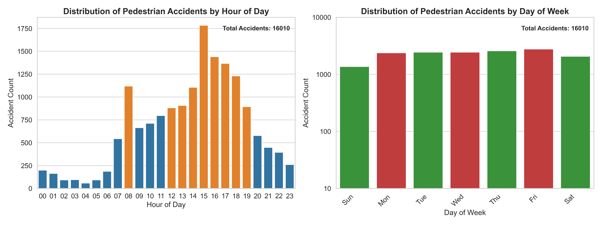

# Enhancing Road Safety through Data Analysis and Predictive Modeling, A Case Study of Road Traffic Accidents in Great Britain 2020

Analyzing UK road accident data to identify patterns and outliers. Focus on accident severity, impact on pedestrians, motorbikes, and other factors. Aiming to predict and improve road safety measures.

## Significant Hours and Days of Accidents
Most accidents occur between midday and early evening, peaking at 5:00 PM, 4:00 PM, and 3:00 PM. There's also a spike at 8:00 AM.

Accidents peak during weekdays, particularly on Thursday and Friday evenings, due to high traffic, fatigue, and distractions. Weekends also see increased accidents, possibly due to social activities.

## Analysis of Motorcycle Accidents by Hour and Day
Motorcycles under 500cc peak in accidents from 3pm to 6pm, especially at 5pm. Mornings are calm, accidents rise from 6am to 12pm. Fridays have the most accidents, weekdays gradually rise, and Sundays have the least. Causes: rush hour, fatigue, poor visibility. Solutions: better signage, awareness campaigns, and strict safety enforcement.

## Significant Hours and Days for Pedestrian Accidents
Peak accidents occur from midday to early evening, exceeding 1000 accidents per hour. A significant surge happens at 8 AM during commute hours. Pedestrian accidents rise from Sunday to Friday due to distraction, traffic congestion, and fatigue, falling on Saturdays with less work-related travel.

## Exploring Impact of Selected Variables on Accident Severity using Apriori Algorithm
Selected variables from accident, vehicle, and casualty tables were processed using random forest for feature selection. Five variables, including casualty, severity, and engine, were transformed into dummy variables. Apriori algorithm was applied with a minimum support of 0.2 and a minimum threshold of 0.8, revealing insights into dataset relationships.

The figure presents association rule mining results, emphasizing the strong relationship between casualty_3 and severity_3. With a support of 81% and confidence of 94.57%, these features exhibit a robust predictive connection, indicated by a lift value of 1.229.

##  Identification and Clustering of Accidents in the Humberside Region
The dataset was filtered for Humberside (police force 16) and analyzed using DBSCAN for pattern identification and hotspot mapping in the region.The figure reveals accident density in Humberside: Kingston upon Hull has the highest density, North and East Lincolnshire show strong clustering, while accidents in East Riding of Yorkshire are dispersed due to its size. Unusual entries were detected using Local Outlier Factor (LOF) for vehicle ages exceeding 25 years (below EURO 4 standard) and driver ages below 16 years, considering exemptions for 16-year-olds.

Vehicles older than 25 years were identified as outliers but retained due to insufficient context. Drivers below 16 years will be replaced with the dataset's median age.
%20Analysis.png)
### Geographical coordinates analysis:  
Geographical coordinates were analyzed using the Isolation Forest algorithm for outlier detection. Outliers were identified based on their predicted status. KMeans clustering with 4 clusters was performed using the elbow method to determine centroids for each cluster.

## Developing a Classification Model for Predicting Fatal Injuries in Road Traffic Accidents
Integrated tables were preprocessed, biased data removed, and classes balanced via under-sampling. SelectKBest identified 15 relevant features. A baseline decision tree model achieved 73.1% accuracy. Hyperparameter-tuned Random Forest outperformed other models with 85% accuracy. The final model achieved 85.2% accuracy, strong precision/recall, and 671 true positives, confirming its effectiveness for imbalanced classification.
 

## Conclusion
This study revealed patterns in traffic accidents: rush hours and fatigue-related risks in evenings and Fridays. Motorcycles posed threats in afternoons, especially on Fridays. Pedestrians faced risks from midday to early evening, peaking during the workweek. Apriori algorithm identified strong associations between severity and casualties. DBSCAN pinpointed accident hotspots. Outlier detection flagged anomalies but didn't impact the study significantly. A predictive Random Forest model excelled in classifying fatal accidents. These insights guide actionable interventions for road safety policies.