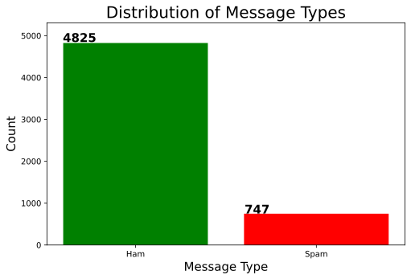
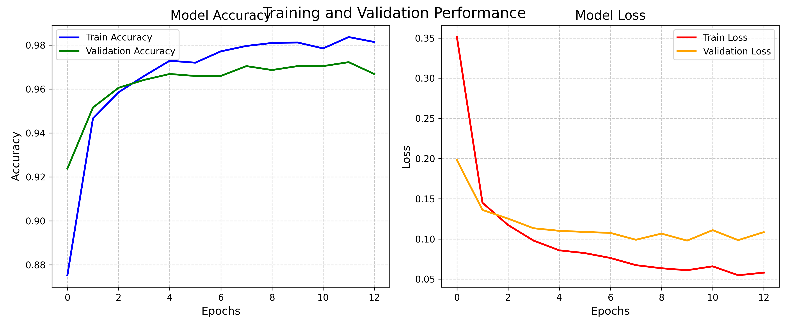

# Multilingual SMS Spam Detection using Cross-Lingual Transfer Learning

SMS spam detection is vital due to the rise in unwanted messages. Traditional methods like SVC, Naïve Bayes, RF, and DT have limitations. Deep learning techniques like CNNs, RNNs, LSTM, and Transformers show promise. Expanding detection to multiple languages is a challenge, but cross-lingual transfer learning offers a solution.

## Objectives of Study
Develop multilingual SMS spam detection using cross-lingual word embeddings for English, French, and German. Evaluate on datasets from 4 languages, analyzing metrics like accuracy, precision, recall, and F1-score.

## Data Processing
In this study, text data underwent key preprocessing steps: lowercase conversion, punctuation removal, lemmatization, and stopword removal using NLTK. After preprocessing, the data was split into an 80% training set and a 20% validation set using train_test_split from sklearn.

## Multilingual Word Representations
Multilingual word representation involves mapping words from different languages with similar meanings to continuous high-dimensional vectors. Techniques like Multilingual BERT and FastText are used. Multilingual BERT supports multiple languages with pre-trained models, while FastText vectorizes words using character n-grams.
### Deep Learning LSTM Model:
LSTM (Long Short-Term Memory) is a type of recurrent neural network that handles sequence prediction problems. It uses gates (input, forget, and output) to control information flow, enabling memory retention and accurate predictions. The mathematical representations for these gates involve weighted inputs and biases.

### Cross-Lingual Transfer Learning:
Transfer learning involves applying knowledge from a well-established domain to a less resource-rich one. In this study, cross-lingual transfer learning utilizes fastText embeddings and LSTM networks. Pre-trained fastText embeddings capture semantic relationships across languages. The model first trains in a high-resource language (English) and then transfers the learned embeddings to a target LSTM model in a low-resource language (Hindi, German, French).
## Result
A simple LSTM base model achieved an accuracy of 87%, precision of 87%, recall of 100%, and F1-score of 93%. Attempts to enhance the model, such as tuning parameters and using RandomOverSampler, did not improve accuracy and even reduced it to 45%. In contrast, the cross-lingual transfer learning model, consisting of LSTM layers, achieved an accuracy of 97% and multilingual precision, recall, and F1-score of 94%, 77%, and 85% respectively.

"The figure illustrates a significant 10% accuracy boost from the baseline LSTM model (0.87) to the cross-lingual transfer learning model (0.97). However, introducing hyperparameter tuning and regularization slightly decreased all evaluation metrics. The accuracy dropped by 4%, precision by 11%, recall by 23%, F1-score by 18%, and AUC-ROC by 3%. This suggests potential overfitting to the majority class, highlighting the need to balance transfer learning usage for specific domains. The interplay of accuracy and AUC-ROC indicates varying classification thresholds."

## Conclusion
This study proves the effectiveness of cross-lingual transfer learning in multilingual SMS spam detection (English, French, German, Hindi). Leveraging pretrained multilingual embeddings, the approach enhanced accuracy from 87% to 97%. Although hyperparameter tuning led to slight overfitting, the transfer model consistently outperformed the base LSTM, highlighting the potential of cross-lingual transfer learning in multilingual NLP tasks with limited labeled data. However, limitations like small datasets, language diversity, and class imbalances warrant further exploration. Future research should focus on larger datasets, diverse languages, optimized architectures, data augmentation, and model introspection, laying a robust foundation for cross-lingual SMS spam detection.